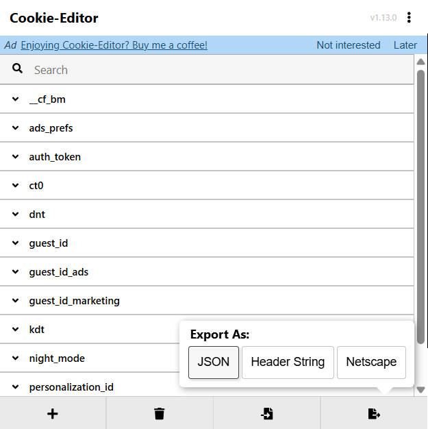

# X-CrawlFox 🦊

[](https://opensource.org/licenses/Apache-2.0)    [](https://github.com/Jiutwo/x-crawlfox/stargazers)

免费、高匿的 X/Twitter 拟人化爬虫命令行工具。

🌐 [English](./README-en.md) | **中文**

---

## 🚀 主要功能特性
**特点**：免费、支持高度定制、增量爬取、内置拟人化行为防风控。

- **拟人化交互**：集成 Camoufox 指纹混淆，模拟真人滚动、随机延迟、键入交互，大幅降低风控风险。
- **时间线抓取**：支持爬取"正在关注 (Following)"和"为您推荐 (For you)"的内容，支持指定抓取数量。
- **深度新闻爬取**：自动抓取"今日新闻 (Today's News)"侧边栏，支持点击进入详情页获取 Grok 摘要及相关热门帖子。
- **关键词搜索**：模拟真实键入行为搜索推文，绕过反爬检测。
- **增量账号监控**：支持多账号监控，自动追踪上次爬取位置，仅抓取新发布的推文。
- **一键全量任务**：通过统一的 JSON 配置文件，一键启动包含时间线、新闻、账号监控、关键词搜索在内的复合爬取任务。
- **自动状态管理**：自动保存登录会话 (Cookie) 和爬取进度 (Crawler State)。

---

## 📦 快速开始

### 安装

1. **从 PyPI 安装**：
   ```bash
   pip install x-crawlfox
   ```

2. **从源码构建**：本项目使用 `uv` 进行包管理。
   ```bash
   git clone https://github.com/Jiutwo/x-crawlfox.git
   cd x-crawlfox
   uv sync
   ```

### 如何使用

#### 1. 初始化配置目录

首次使用前，运行以下命令在当前目录下生成 `.x-crawlfox` 配置文件夹及默认配置：

```bash
x-crawlfox init

# 若希望配置保存到用户主目录（全局模式）：
x-crawlfox init --global
```

#### 2. 账号登录或 Cookie 导出（必备）

在进行爬取前，需先获取登录状态的 Cookie。

**注意**：如果使用刚注册的账号立即爬取，容易被 X 封禁，建议先正常使用一段时间。

**方式一：使用浏览器插件 Cookie Editor 导出（推荐）**

通过浏览器插件 Cookie Editor 导出当前登录浏览器的 Cookie 为 JSON，保存至 `.x-crawlfox/x_cookies.json`。

`.x-crawlfox` 文件夹可位于当前目录或用户主目录下，x-crawlfox 会自动识别。程序会在加载时自动将 Cookie Editor 格式转换为内部格式，无需手动处理。



**方式二：使用命令行登录**

```bash
x-crawlfox x login
```

在弹出的浏览器窗口中完成登录，回到终端按 Enter 保存状态。登录状态会自动保存至 `.x-crawlfox/x_cookies.json`。

> 若登录过程中被 X 识别为可疑操作而拦截，建议改用方式一。

#### 3. 爬取个人时间线

```bash
# 爬取"关注"页前 20 条
# 末尾加上 --no-headless 参数可视化查看操作
x-crawlfox x timeline --type Following --max-items 20

# 爬取"推荐"页
x-crawlfox x timeline --type "For you" --max-items 50
```

#### 4. 爬取今日新闻

```bash
# 仅爬取侧边栏列表
x-crawlfox x news

# 深度爬取：进入详情页抓取摘要和相关帖子
x-crawlfox x news --detail --max-items 3
```

#### 5. 抓取 / 监控指定用户

```bash
# 抓取指定用户最新的 20 条推文
x-crawlfox x user elonmusk --max-tweets 20

# 增量抓取：仅抓取该用户自上次运行以来发布的新内容
x-crawlfox x user elonmusk --only-new
```

独立运行多账号监控（读取 `crawl_config.json` 的 `x.monitor` 段）：

```bash
x-crawlfox x monitor
```

也可指定自定义配置文件（flat list 格式）：

```bash
x-crawlfox x monitor --config my_accounts.json
```

#### 6. 一键执行复合任务

编辑 `.x-crawlfox/crawl_config.json`，然后运行：

```bash
x-crawlfox x all
```

也可通过 `--config` 指定其他配置文件路径：

```bash
x-crawlfox x all --config /path/to/crawl_config.json
```

`crawl_config.json` 格式示例：

```json
{
    "global": {
        "output_dir": "output",
        "headless": true
    },
    "x": {
        "timeline": [
            { "type": "For you",   "max_scrolls": 2, "max_items": 10 },
            { "type": "Following", "max_scrolls": 3, "max_items": 10 }
        ],
        "news": {
            "enabled": true,
            "detail": true,
            "max_items": 5
        },
        "monitor": [
            { "username": "elonmusk", "only_new": true, "max_tweets": 10 },
            { "username": "OpenAI",   "only_new": true, "max_tweets": 10 }
        ]
    }
}
```

---

### 📂 存储与配置 (.x-crawlfox)

为了保护隐私并支持持久化，X-CrawlFox 使用 `.x-crawlfox` 文件夹存储敏感数据：

1. **存储位置**：
   - **局部模式**：程序优先检查当前运行目录下是否存在 `.x-crawlfox` 文件夹，若存在则所有数据存放于此（适合多账号隔离）。
   - **全局模式**：当前目录不存在该文件夹时，自动使用用户主目录下的 `~/.x-crawlfox`（Windows 为 `%USERPROFILE%\.x-crawlfox`）。

2. **存储内容**：
   - `x_cookies.json`：存储 X 的登录 Cookie 和认证令牌。**请勿泄露此文件**。
   - `crawl_config.json`：全量爬取任务的统一配置文件，供 `all` 和 `monitor` 命令使用。
   - `x_crawl_state.json`：存储每个监控账号已爬取的最后一条推文 ID，用于增量抓取。

3. **输出位置**：
   所有抓取结果均以 `.jsonl` 格式保存于 `output/` 目录下，方便后续数据分析或入库。

---

## 🙏 感谢

本项目深受开源社区的启发，并集成了 [Camoufox](https://github.com/daijro/camoufox) 等优秀的开源项目。衷心感谢所有为本项目提供基础支持的开源库及开发者们。

---

## ⚠️ 免责声明

本工具仅供学习和研究目的使用。请遵守 X (Twitter) 的服务条款。因使用本工具导致的账号限制或法律纠纷，由使用者自行承担。
